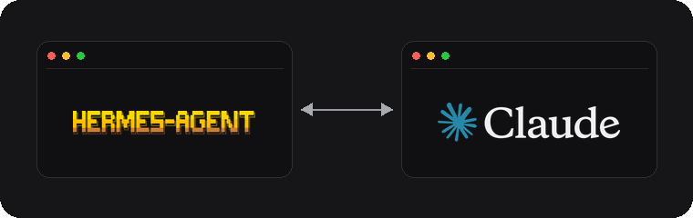
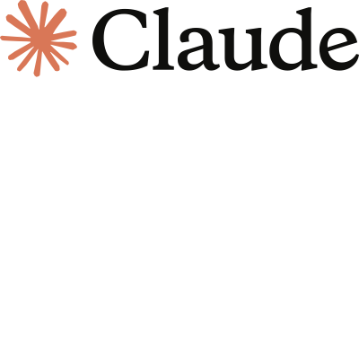
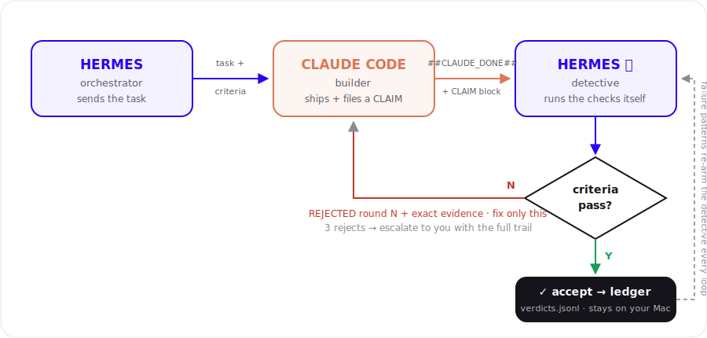

<p align="center">
  
</p>

<h1 align="center">Hermes Pong</h1>

<p align="center">
  <strong>Two terminals. One bridge. A whole team if you want.</strong><br />
  Hermes orchestrates. Your AI terminals build — Claude by default, any model you sign into.
</p>

<p align="center">
  <a href="https://kulpio.github.io/Hermes-Pong/">Website</a> ·
  <a href="https://github.com/kulpio/Hermes-Pong/releases/latest">Download</a> ·
  <a href="#install-macos">Install</a>
</p>

<p align="center">
  
</p>

---

## What it does

**Hermes Pong** is a small macOS menu bar app that pairs:

| | |
|--|--|
|  | **Hermes** — plans, orchestrates, decides next steps |
|  | **Workers** — Claude Code by default; Kimi, Grok Build, Codex, custom CLIs |

SuperGrok / Premium+ users pair **Grok Build** exactly like Claude Code: it launches your own `grok` CLI on your Grok login and weekly pool (override the command in `~/.hermes-pong/workers.json`, e.g. `{"grok": {"cmd": "grok"}}`). Pong never hosts API keys.

Hermes sends a task into your **live worker terminal** (paste + Enter). Default is Claude Code; same bridge targets any window you pair. You keep model, resume, and chat.

> Chatting only inside Hermes does **not** reach Claude. Work crosses the bridge with one command (below).

---

## Multi-worker teams (v1.3.1)

One **Hermes** orchestrates one or more **workers** under a single Active pair (tree UI).

| | |
|--|--|
| **New pair** | **Claude** · **Other Model** · **Team** · **Show Teams** (when you have saves) · Cancel |
| **Team** | Vertical picker: add models top→bottom, launch stacked Terminals |
| **Options** | Hermes row: Save Team, display name, project root, team brief (brief + root injected on every handoff) |
| **Hide / Show** | Hermes row: stow a team's Terminal windows off-screen; pair and tmux keep running. Options has Focus this team (stows every other pair) |
| **Show Teams** | Manager: click a team to open, **Duplicate**, **Delete**. Scrolls. Hidden when you have zero saves |
| **Tree** | Hermes hub → each worker with Front / Kill / Perms |
| **Bridge** | `pong-delegate.py --worker w1` (alias of `claude-delegate.py`) |

Saved teams live in `~/.hermes-pong/teams.json` on your Mac only.

**Multi-team isolation:** every pair binds its Hermes to that pair only (`HERMES_PONG_SESSION`, set at launch). `pong-gate.py` and `pong-delegate.py` resolve workers strictly inside the bound session, so several teams (`hermes-pair`, `hermes-pair-1`, …) can run at once without cross-talk — same worker names on two teams are fine, and ambiguous keys fail closed instead of guessing. `pong-delegate.py --dry-run` shows the bound session, roster, and target without sending; `hermes_pong.py status` prints your binding any time.

Details: [`docs/PRODUCT-MULTI-WORKER.md`](docs/PRODUCT-MULTI-WORKER.md).

### Naming

- Click a **Hermes** or **worker** name in Active pairs to rename it.
- Titles are pushed into **Terminal** (custom title only) and **tmux** window names for that pane.
- Only pair panes are retitled — matched by `tmux attach-session -t <view>` (never your other Terminals).

### Colors

Click the small **color swatch** next to Hermes or a worker:

| Swatch | What it paints |
|--------|----------------|
| **Background** | Terminal background |
| **Text** | Normal text |
| **Marker** | Accent (bold + cursor). Terminal has no title-bar color API |

Each role gets a **private** Terminal profile (`HP-…`) so colors stay on that pane only.

### Permissions (Perms)

Per-**worker** only (Hermes row has **Save Team** instead of Perms):

- Checkboxes: ban MCP, root writes, network, system paths, repo-only, ask each time
- Freeform note injected on every handoff
- Presets: **Full access**, **Ask each time** (highlighted when selected), **Load saved…**, **Save as…**

---

## Requirements

- macOS
- [Terminal.app](https://support.apple.com/guide/terminal/welcome/mac)
- [tmux](https://github.com/tmux/tmux) (`brew install tmux`)
- [Hermes](https://github.com/NousResearch/hermes-agent) (or your Hermes CLI)
- [Claude Code](https://claude.ai/code) CLI (or another worker CLI)

---

## Install (macOS) — v1.3.1

### Option A — release zip

1. Open the [latest release](https://github.com/kulpio/Hermes-Pong/releases/latest)
2. Download **HermesPong-macOS.zip** (or from the [landing page](https://kulpio.github.io/Hermes-Pong/))
3. Unzip → drag **Hermes Pong** into **Applications**
4. Double-click to open — release builds are signed and notarized when published that way; source builds are ad-hoc signed for local use

On first launch a small welcome window explains the two one-time permissions (see [Permissions](#macos-permissions)).

### Option B — from source

```bash
git clone https://github.com/kulpio/Hermes-Pong.git
cd Hermes-Pong
bash scripts/setup.sh
```

That builds and installs `/Applications/HermesPong.app`.

Optional: start at login:

```bash
bash scripts/setup.sh --login
```

---

## Quick start

### 1. Link what you already use (recommended)

Best when a worker is already open with the right model / session.

1. Open **Hermes** in one Terminal window  
2. Open **Claude Code** (or another worker) in another  
3. Launch **Hermes Pong** (menu bar bolt or Dock)  
4. Click **Link existing terminals**  
5. Select the **Hermes** window, then each **worker** window  
6. You should see the pair under **Active pairs**

Nothing is injected into the worker at link time. Your model, resume, and chat stay as they are.

### 2. Or start a New pair

1. Click **New pair**  
2. Choose **Claude**, **Other Model**, **Team**, or **Show Teams**  
3. Terminals open: Hermes + the workers you picked (stacked vertically)  

Use **Link** when you care about an existing worker conversation.  
Use **Save Team** on an active pair, then **Show Teams** next time.

### 3. Name, color, save

1. Click names to rename Hermes / workers  
2. Click swatches for Background / Text / Marker  
3. **Save Team** on the Hermes row → **Show Teams** to open / duplicate / delete later  

---

## How the bridge works

```text
┌─────────────────┐         claude-delegate.py          ┌──────────────────┐
│  Hermes window  │  ── paste + Enter ─────────────────► │  Worker terminal │
│  (orchestrate)  │         pong-delegate --worker wN    │  (build & code)  │
└─────────────────┘                                      └──────────────────┘
```

From Hermes (or any shell), send work like this:

```bash
python3 ~/bin/claude-delegate.py --no-wait \
  'Your task here. When completely done, print exactly ##CLAUDE_DONE## then a short summary.'
```

Multi-worker:

```bash
python3 ~/bin/pong-delegate.py --worker w2 --no-wait '… ##CLAUDE_DONE##'
```

| Mode | When | Where the task lands |
|------|------|----------------------|
| **Link existing** | You registered open Terminals | Those real windows |
| **New pair** | App opened fresh Terminals | That pair’s worker panes (via tmux) |

**Do not** hand-type raw `tmux send-keys` into a hidden pane if you want to *see* the work in the worker UI. Use `claude-delegate.py` / `pong-delegate.py`.

### Verdict loop

Since v1.3, Hermes doesn’t take the worker’s word for it. When the worker prints `##CLAUDE_DONE##` plus a **CLAIM block** (files changed, commands run, test tail), Hermes independently runs the acceptance checks before accepting. Every accept/reject lands in a local ledger (`~/.hermes-pong/ledger/`) so recurring failure patterns follow into the next session. Three rejects on one task escalate to you with the full evidence trail.

<p align="center">
  
</p>

The loop always runs — there are no supervision modes to configure. It works silently until accept, or escalates to you after three rejects. The menu bar shows the ledger at a glance (rounds, accept rate, reject streak).

**Privacy:** everything — pairs, teams, tasks, and the verdict ledger — stays on your Mac. Nothing is sent anywhere.

---

## Control panel

| Control | What it does |
|--------|----------------|
| **New pair** | Claude · Other Model · Team · Show Teams (if any saves) |
| **Show Teams** | Only when ≥1 saved team. Open (click row), Duplicate, Delete. Scrollable list |
| **Link existing terminals** | Pair open Hermes + worker windows (keeps sessions) |
| **Active pairs tree** | Hermes hub → workers; scrolls if long |
| **Front / Kill** | Per Hermes or per worker |
| **Save Team** | Hermes row — snapshot names, colors, workers, perms |
| **Perms** | Per worker — bans + note + highlighted presets |
| **Name / color swatch** | Rename + Background / Text / Marker for that pane |
| **Refresh / Close Panel** | Sticky footer — always at the bottom |

The menu bar bolt glows while a pair is active and shows the verdict ledger (rounds, accept rate, reject streak, last verdict).

---

## macOS permissions

Two one-time permissions, both explained by the first-run welcome window:

- **Automation** — Hermes Pong sends tasks into your Terminal windows. macOS prompts the first time a task is sent; if you decline, re-enable it under **System Settings → Privacy & Security → Automation**.
- **Accessibility** — needed so paste + Enter lands reliably in the worker window: **System Settings → Privacy & Security → Accessibility** (allow Terminal and the tools you use to run the bridge).

The welcome window has buttons that jump straight to both Settings panes.

---

## Tips & free download

Pay what you want (including **$0**):

**https://kulpio.github.io/Hermes-Pong/**

---

## Optional: Hermes Agent skill

The Mac app pairs windows. **Hermes Agent** still needs a skill so it keeps sending work to Claude (and runs the verdict loop on every CLAIM).

Optional install (no personal config; safe to re-run):

```bash
bash scripts/install-hermes-skill.sh
# or with full setup:
bash scripts/setup.sh --with-hermes-skill
```

This installs:

- Skill `hermes-pong-bridge` → `~/.hermes/skills/workflow/`
- CLIs → `~/bin` (`claude-delegate.py`, `pong-delegate.py`, `claude-window-relay.py`, `pong-gate.py`, `pong-ledger.py`)
- Task template → `~/.hermes-pong/templates/task.md`
- Short agent hint → `~/.hermes-pong/AGENT-HINT.md`

Restart Hermes after installing. Then, when a pair is active:

```bash
python3 ~/bin/pong-gate.py   # BRIDGE_ON?
python3 ~/bin/claude-delegate.py --no-wait '… ##CLAUDE_DONE##'
```

## Rebuild (developers)

```bash
bash scripts/build-app.sh
bash scripts/install.sh
```

App version is set in `scripts/build-app.sh` (`VERSION=1.3.1`).

---

## Changelog (v1.3.1)

First downloadable multi-worker teams release after 1.2.0 (repo had the work; GitHub Latest was still 1.2).

- Multi-worker **teams** under one Hermes (tree UI)
- **New pair**: Claude / Other Model / Team / Show Teams / Cancel
- **Save Team** + **Show Teams** manager (open / duplicate / delete, scrollable; hide when empty)
- Per-pane **rename** + **colors** (Background, Text, Marker)
- Per-worker **Perms** with highlighted presets (Hermes Save Team has no Perms)
- Sticky **Refresh / Close Panel**; scrollable active pairs + Show Teams
- Terminal themes via NSAppleScript + attach-session; `pong-delegate --worker`
- Landing: multi-worker team art/blurb; tip flow (name + email)
- Verdict loop always on; local ledger

---

<p align="center">
  
  <br />
  <sub>Built for people who want Hermes to drive — and any signed-in terminal to ship.</sub>
</p>
