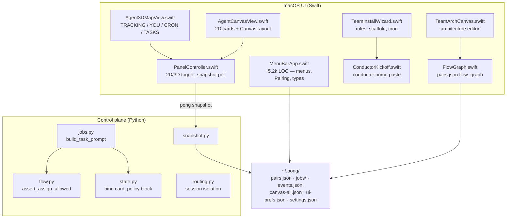
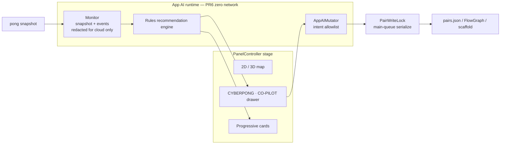
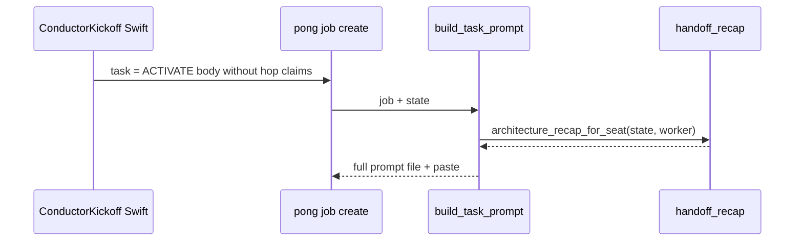

# CyberPong — App AI, 2D parity, OpenClaw, telemetry, residue cleanup, architecture-aware handoffs

| Field | Value |
|-------|-------|
| **Author** | CyberPong design (program umbrella) |
| **Date** | 2026-07-21 |
| **Status** | Draft (rev 3 — re-review open issues addressed) |
| **Repo** | `/Users/dylandemnard/Personal/Projects/HermesPong` (GitHub: kulpio/hermes-pong) |
| **Audience** | Senior engineers familiar with `src/*.swift` + `python/pong/` |
| **Scope note** | Program-level design spanning six workstreams. Each PR below is sized for independent review; App AI cloud + HTTPS telemetry are later phases under this umbrella. |

---

## Overview

CyberPong is a macOS menu-bar **local agent mission control** app: teams of conductor + worker CLI seats, a job control plane on disk (`~/.pong/`), and a dual 2D/3D map surface. The control plane is Python (`python/pong/`); the panel is Swift (AppKit + SceneKit). The UI must consume `pong snapshot` as its authoritative envelope ([`docs/UI-CONTRACT.md`](docs/UI-CONTRACT.md)).

This design covers **six product workstreams** that together close the gap between “usable shell” (~80% of v1 north star per [`docs/ROADMAP.md`](docs/ROADMAP.md)) and a polished day-1 experience:

1. **App-level AI** — architecture co-pilot + CyberPong chat that can mutate team topology without the full install wizard.
2. **OpenClaw** — first-class worker/conductor type next to Claude, Grok, Codex, etc. (**research-gated** seat runtime — not a naive CLI seed).
3. **2D view parity** — shared status semantics, flow_graph-true edges, working glow; HUD parity staged to avoid 3D blast radius.
4. **Product telemetry** — opt-in usage signals; **v1 = local export only** until authenticated HTTPS endpoint exists.
5. **Team residue cleanup** — `TeamSanitizer` as sole remove/reconcile API; mutation-triggered (not every poll).
6. **Architecture-aware handoff recaps** — Python SSOT injected on every job; Swift kickoff shells out or defers hop text to the wrapper.

All work stays **local-first**: teams, jobs, and ledger remain on the Mac; CyberPong never stores vendor API keys. Any cloud calls (App AI LLM, telemetry HTTPS) are explicit, redacted, feature-flagged, and off by default.

---

## Background & Motivation

### Current architecture (facts from the tree)



| Concern | Where it lives today |
|---------|----------------------|
| Conductor / worker type pickers | `ConductorType.all` / `WorkerType.all` in [`src/MenuBarApp.swift`](src/MenuBarApp.swift) (~L398–480) |
| Team create | `Pairing.startFresh` → optional `TeamInstallWizard` → `TeamWizardApply.apply` |
| Topology | `flow_graph.edges` on pair; enforced by [`python/pong/flow.py`](python/pong/flow.py) |
| 2D positions | `CanvasLayout` → `pairs.json` `canvas_positions` + `~/.pong/canvas-all.json` |
| 3D positions | `Map3DLayout` → pair `map3d_positions` ([`src/FlowGraph.swift`](src/FlowGraph.swift)) |
| Kickoff / role priming | [`src/ConductorKickoff.swift`](src/ConductorKickoff.swift) — activate tasks hard-code “jobs from c1” |
| Job paste text | `jobs.build_task_prompt` — team context + policy + task; **no architecture hop recap** |
| Remove seat (map Kill) | `PanelController.killModel` → `Workers.removeWorker` — **no** `flow_graph` / position prune |
| Remove seat (Architecture) | `TeamArchCanvas.deleteSeat` → external `removeWorker` **then** local `edges.removeAll` + `onChanged` → persist |
| Snapshot workers | Already includes `mission_role` ([`snapshot.py`](python/pong/snapshot.py) L82) |
| Settings path | `PairState.settingsPath` → `~/.pong/settings.json` (almost unused); `ui-prefs.json` is appearance-only |
| Entitlements | [`resources/entitlements.plist`](resources/entitlements.plist) — only `com.apple.security.automation.apple-events` (no network client) |

### Pain points driving this design

| # | Pain | Evidence |
|---|------|----------|
| 1 | Architecture setup is wizard-heavy; progressive “seat next to the node” coaching is missing | Wizard multi-step; no app-level co-pilot |
| 2 | OpenClaw installed but not a CyberPong type; wrong “drop-in CLI” assumption | Not in type arrays; `agent --local` is one-shot (`-m` required); long-lived is `openclaw tui` + gateway |
| 3 | 2D is second-class: no HUD stack; edges ignore `flow_graph`; no working-glow matching 3D | `AgentCanvasView.draw` hard-codes orch→workers + peer chain |
| 4 | No privacy-respecting product usage signal | Cron “Telemetry sync” is a **demo job name** only |
| 5 | Residue after remove / new team | Map Kill leaves edges + positions; arch path prunes edges but not positions |
| 6 | Agents don’t get architecture-true next-hop instructions | Kickoff + `build_task_prompt` lack edge-derived recaps |

---

## Goals & Non-Goals

### Goals

1. Ship an **App AI** (distinct from team conductor) that:
   - Offers a **default team template** so users can skip the full wizard.
   - Drives **progressive discovery** (cards; node-anchored when map anchors exist).
   - Recommends topology / role / cron / policy changes from live snapshot + events.
   - Exposes a **CyberPong chat** that produces durable architecture mutations via an **allowlisted intent catalog**.
2. Register **OpenClaw** as a first-class seat type **after** a spike proves a viable interactive/gateway seat model.
3. Bring **2D canvas** toward 3D parity for status glow, flow_graph edges, and (staged) HUD windows, with a **shared status model**.
4. Implement **opt-in product telemetry** starting with **local export**; HTTPS only when endpoint auth + entitlements exist.
5. Make seat-remove / new-team paths use **`TeamSanitizer` as the sole external remove/reconcile API**.
6. Generate **per-hop handoff recaps** from live `flow_graph` + `mission_role` + parent chain (Python SSOT).

### Non-Goals

- Replacing vendor TUIs or streaming live tokens.
- Hosting or proxying vendor API keys for Claude/Grok/etc.
- Umbra / standing grants / geo policy.
- Multi-tenant cloud orchestration.
- Telemetry or cloud App AI on by default.
- Greenfield rewrite of `TeamArchCanvas` / `FlowGraph` / wizard.
- Full visual twin of 3D HUD in a single PR (staged extraction only).
- Writing bare-key-free CanvasLayout rewrite unless invariants fail tests (minimal hardening first).

---

## Proposed Design

### Workstream 1 — App-level AI monitor + architecture co-pilot + CyberPong chat

#### 1.1 Placement: where the App AI lives

**Decision: App-local in-process service + in-panel chat surface — not a team seat.**

| Option | Pros | Cons |
|--------|------|------|
| **A. Panel chat + local rules/LLM planner (chosen)** | Distinct from conductor; multi-team; clear privacy boundary | New UI chrome |
| B. Special seat on every team (`type: app_ai`) | Reuses jobs/tmux | Isolation / graph pollution |
| C. Pure remote SaaS chat | Model quality | Breaks local-first |



- **YOU · HUMAN** (3D dock) stays human → orchestrator. **CYBERPONG · CO-PILOT** is a **separate** drawer (right rail or bottom sheet) on both 2D and 3D.
- **v1 (PR6): rules-only, zero network.** No model vendor call. Cloud adapter is PR7 behind flags.
- **Not** a `workers[]` entry; never a `flow_graph` hop.

#### 1.2 Default team template (skip wizard)

| Field | Default |
|-------|---------|
| Conductor | User-picked, else Grok Build |
| Workers | User-picked, else 1× Claude `w1` `mission_role=coder` |
| `flow_graph` | **Explicitly** `FlowGraph.save(pair, defaultEdges(entry))` immediately after `savePairState` / template apply — **not** deferred to panel poll |
| Policy | Empty / permissive |
| Scaffold | Optional light TEAM.md under `~/.pong/teams/<session>/` only if user opts in |
| Cron | `[]` |
| Kickoff | After edges written, so recaps (PR3) see a non-empty graph |

**Why explicit save:** `Pairing.startFresh` today does **not** write `flow_graph` ([`MenuBarApp.swift`](src/MenuBarApp.swift) ~L2610–2660). Panel seeds empty graphs later (~L1106–1114). Empty graph = open assign in `flow.assert_assign_allowed` (works) but recaps need **one** implicit-default algorithm matching Swift `FlowGraph.defaultEdges` (delegate+claim loops; peer chain among top-level workers when 2+; sub+claim for `parent_id`).

**Entry points:** Quick launch, App AI “Start with defaults”, menu **New team → Default setup**.

#### 1.3 Progressive discovery UX

Node-anchored cards when map geometry is available; **PR6 may ship non-anchored panel cards** (no dependency on HUD extract):

```text
┌──────────────────────────────────┐
│ Co-pilot                         │
│ Want w1 to be a reviewer?        │
│ [Yes · Reviewer] [Coder] [Dismiss]│
└──────────────────────────────────┘
```

Card model → actions map to **intent ids** from Appendix A (not free-form writes).

Progression for new default team: name/root → role → optional second seat → policy → cron (only if asked). Dismissals: `~/.pong/app-ai/dismissed.json`.

#### 1.4 Recommendation engine triggers

| Trigger | Source | Example → intent |
|---------|--------|------------------|
| Team created / wizard skipped | pair.saved | progressive cards → various |
| Snapshot poll (read-only) | status_hint, open_jobs | suggest rebalance → chat prompt, not auto-write |
| Orphan edges / seats | dry-run sanitizer | `sanitize` card |
| Reject streak | ledger | suggest reviewer seat |
| Cron empty + user ask | CronSchedule | `set_cron` |
| Architecture focus idle | UI focus | soft tips only |

**Concurrency (ships in PR2, not deferred to App AI):** All **in-process Swift** pair writes eventually go through **`PairWriteLock`** / `PairState.mutate(session:_:)` — serialize on main (or a dedicated writer that always hops to main before disk). Cross-process Python CLI writers are out of scope for the Swift lock (file-level last-writer-wins remains; Python may later add its own flock if needed).

| Phase | Who must use the lock |
|-------|------------------------|
| **PR2** | Introduce thin `PairState.mutate` + lock; route `TeamSanitizer.removeSeat` / `reconcile`, and any `FlowGraph.save` / worker list writes the sanitizer performs |
| **PR2–5 opportunistic** | Migrate `Workers.*`, `FlowGraph.save`, `CanvasLayout.saveSeat`, wizard apply, rename when those call sites are touched |
| **PR6** | `AppAIMutator` always under lock; stress-test concurrent UI + mutator |

Direct concurrent `Pong.writeJSON(pairsPath)` from new code is forbidden. Preview diffs are pure-function over a snapshot copy; apply re-loads pair under lock.

#### 1.5 Chat → durable architecture mutations

```mermaid
sequenceDiagram
  participant U as User
  participant Chat as Co-pilot UI
  participant Plan as Planner rules/LLM
  participant Mut as AppAIMutator
  participant Lock as PairWriteLock
  participant Disk as pairs.json

  U->>Chat: "Make w2 a reviewer and claim to c1"
  Chat->>Plan: redacted context (Appendix B)
  Plan->>Mut: intents[]
  Mut-->>Chat: PreviewDiff { before, after, intents }
  U->>Chat: Confirm once for whole batch
  Mut->>Lock: apply sequential intents
  Lock->>Disk: commit each intent as it succeeds
  Note over Mut,Disk: v1 = sequential commit, no automatic rollback. On failure stop; return applied prefix + failed intent. User undoes via UI or sanitize — not a pairs.json journal.
```

**v1 apply error model (single policy — no dual wording):**

| Rule | Spec |
|------|------|
| Confirm | **One confirm** for the whole batch (PreviewDiff shown first). Destructive intents still force that confirm path (never auto-apply). |
| Commit | **Sequential commit** under `PairWriteLock`. Each intent writes disk when it succeeds. |
| On failure | **Stop immediately.** Do **not** attempt automatic undo of prior intents in the batch (no journal / no transactional multi-write). |
| Report | Return `ApplyResult` (below). Surface applied prefix + failed intent; offer **Sanitize** if graph may be inconsistent. |
| Rollback | **Manual only** — user reverts via UI (re-set role, undo edge) or `TeamSanitizer` / Architecture canvas. |
| PR6 scope note | Multi-intent batches are allowed after one confirm. Callers that want all-or-nothing must send **one intent at a time** and only confirm the next after success (chat can do this for destructive chains). |

```json
{
  "ok": false,
  "applied": [{ "intent": "set_mission_role", "seat_id": "w2" }],
  "failed": { "intent": "set_edges", "error": "unknown seat w9" },
  "skipped": [{ "intent": "set_cron", "reason": "not_reached" }]
}
```

Rules:

- Only Appendix A intents.
- Destructive intents require confirm (see table) — still one batch confirm covering them.
- Chat never invents job status.
- Transcripts: `~/.pong/app-ai/chats/*.jsonl` local only.
- **No silent partial success:** UI must show `ApplyResult` whenever `applied` is non-empty and `ok` is false.

#### 1.6 Conductor relationship

| Actor | Role |
|-------|------|
| **App AI** | Helps **human** design teams / architecture |
| **Team conductor** | Mission work while `BRIDGE_ON` |

App AI does not paste into conductor TUI unless user asks “prime conductor” → `ConductorKickoff`.

#### 1.7 Privacy for App AI

**PR6 (rules-only):** zero network. Snapshot is read in-process; no egress.

**PR7 (optional cloud):** only Appendix B allowlisted JSON. See § Security and Appendix B.

| Toggle (settings.json) | Default | Effect |
|------------------------|---------|--------|
| `app_ai.cloud_enabled` | false | Master cloud switch |
| `app_ai.share_team_structure` | true if cloud on | seats types/roles/edge kinds |
| `app_ai.share_job_previews` | **false** | task_preview / task text |
| `app_ai.share_full_paths` | **false** | full project_root vs basename |

Never: API keys, window ids, `PONG_TOKEN`, bind card bodies, terminal buffers, code.

---

### Workstream 2 — OpenClaw as first-class worker / conductor

#### 2.0 Research gate (**blocking for type registration PR**)

Verified against OpenClaw `2026.2.3-1` on this machine:

| Command | Behavior | Seat fit |
|---------|----------|----------|
| `openclaw agent --local -m "…"` | **One-shot** agent turn; **`-m/--message` required** | Matches **headless** transport, not long-lived TUI |
| `openclaw tui` | Long-lived terminal UI **connected to Gateway** | Closest to `claude`/`grok` seat if gateway up |
| `openclaw gateway` | WebSocket gateway service | Prerequisite for `tui` |

**Do not ship menus that launch `openclaw agent --local` without `-m`.** That process exits/errors and breaks `job+paste` assumptions.

**Spike PR0 (timebox 0.5–1 day, no menu registration):**

1. Confirm `openclaw tui` stays alive in tmux with gateway running (`openclaw gateway` / doctor).
2. Record window title tokens for `looksLikeTui` (likely includes “openclaw”, “tui”, gateway UI chrome).
3. Decide **primary seat mode**:

| Mode | Cmd seed | Transport default | When |
|------|----------|-------------------|------|
| **TUI+gateway (preferred if spike OK)** | `openclaw tui` | `job+paste` like other CLIs | Gateway healthy |
| **Headless agent turns (fallback)** | Seat may show log/status only | `transport_default: "headless"` + mapped argv (below) — **not** tmux paste | No stable TUI or gateway down |

4. Document user prerequisite: run `openclaw doctor`; CyberPong may offer “Start gateway” helper but does not own OpenClaw auth.
5. Keep type id `openclaw` regardless of mode; `cmd` and `transport_default` are mode-dependent and overridable via `workers.json` / `conductors.json`.

**Headless transport mapping (acceptance for PR0/PR1 if headless remains a mode):**

Today [`python/pong/transports/headless.py`](python/pong/transports/headless.py) only knows:

```python
HEADLESS = {
    "grok": ["grok", "-p", "{prompt}", "--yolo"],
    "claude": ["claude", "-p", "{prompt}"],
    "hermes": ["hermes", "chat", "-q", "{prompt}", "-Q"],
    "codex": ["codex", "exec", "{prompt}"],
}
# unknown type → shlex.split(cmd) + ["-p", prompt]  # WRONG for OpenClaw
```

OpenClaw **must not** use the generic `-p` fallback. Add an explicit template, e.g.:

```python
"openclaw": [
    "openclaw", "agent", "--local",
    "-m", "{prompt}",   # -m/--message required; NOT -p
],
```

Prefer substituting the **full job prompt text** (or a short path instruction if argv length is an issue — spike decides; if path, document e.g. `-m` with `Read job file at {prompt_path}`). Acceptance criteria:

1. `HEADLESS["openclaw"]` present and uses **`-m`**, never `-p`.
2. Custom fallback path is **not** used for `type == "openclaw"`.
3. When TUI unavailable, pair/seat may set `transport_default: "headless"`.
4. Unit test: argv for openclaw contains `-m` and does not append `-p`.

**Blocking:** Open Question “interactive model” is **blocking for OpenClaw type PR**. Sanitizer, recaps, 2D work are not blocked.

#### 2.1 Detection

```swift
enum OpenClawDetect {
    static func isInstalled() -> Bool { /* PATH + ~/.openclaw/openclaw.json + nvm/brew paths */ }
    static func version() -> String? { /* openclaw --version */ }
    static func gatewayLikelyRunning() -> Bool { /* best-effort: port/config or `openclaw doctor` parse */ }
    /// Research-gated; never return a one-shot agent cmd without -m.
    static func defaultSeatCmd(mode: SeatMode) -> String {
        switch mode {
        case .tui: return "openclaw tui"
        case .custom: return "" // user fills
        }
    }
}
```

#### 2.2 Schema / type id

| Location | Change |
|----------|--------|
| `WorkerType.all` | `id: "openclaw"`, label OpenClaw, cmd from spike (**after** PR0), **immediately after Claude** in worker menus |
| `ConductorType.all` | Same id; Grok remains **first**/recommended; OpenClaw after Claude among non-recommended, before Custom |
| `CONDUCTOR_TYPES` | Add `"openclaw"` |
| Worker types in schema | **No** `WORKER_TYPES` frozenset today — workers stay open-ended; do not invent a symmetric enum |
| `DONE_MARKERS` | generic `##WORKER_DONE##` |
| Bridge skill | `pong-bridge` (same as non-grok/hermes) |
| `looksLikeTui` | Add `"openclaw"` + spike-discovered tokens |

#### 2.3 Menu placement & fallback

- Worker staff: Claude → **OpenClaw** (if installed; else disabled “OpenClaw — not installed / run doctor”) → others.
- If installed but gateway down and mode is TUI: allow pick but surface warning; optional headless team transport.
- Custom command still available.

#### 2.4 Launch / bind / tmux

- **TUI mode:** same `startFresh` path as other CLIs (`exec openclaw tui`).
- **Headless mode:** seat may still open a log/status window; jobs use `transport_default: "headless"` and `HEADLESS["openclaw"]` argv (`openclaw agent --local -m …`) — **not** tmux paste into a one-shot process, and **not** the generic `cmd + -p` fallback in `headless.py`.
- Isolation env (`PONG_SESSION`, `PONG_SEAT`, `PONG_TOKEN`) unchanged.

---

### Workstream 3 — 2D view parity

#### 3.1 Feature parity matrix

| Feature | 3D | 2D today | Target | PR |
|---------|----|----------|--------|-----|
| Seat cards / Open / Policy / Kill | module + menu | action bar | keep | — |
| flow_graph edges | plotlines | hard-coded orch→w + peer | `FlowGraph.load` | PR4 |
| Working glow | `seatIsActivelyWorking` | status pill only | shared `SeatActivity` + glow | PR4 |
| Drag positions | map3d_positions | CanvasLayout dual-write | harden invariants | PR2/4 |
| TRACKING / YOU / CRON / TASKS | left HUD | ❌ | 2D embeds shared builders first | PR5a–5b |
| Full HUD extract from 3D | embedded | — | optional unify | PR5c |

#### 3.2 CanvasLayout invariants (positions)

Dual-write is intentional ([`AgentCanvasView.swift`](src/AgentCanvasView.swift) L51–76): bare + `session::id` into pair entry and `canvas-all.json`. `origin` prefers scoped then bare (L34–37).

**Invariants:**

1. **Multi-team layout keys must be `session::seatId`** when resolving positions in multi view.
2. **Single-team view** may use bare ids for the focused session.
3. **Sanitizer** deletes **both** bare and scoped keys for removed seats from pair + canvas-all.
4. **Hardening (optional, PR4):** stop writing bare keys into `canvas-all.json` (keep bare only on pair entry for single-team). If not done, multi-view must **never** apply bare keys from another session (already: merge local over all — still risk if two sessions drag `w1` bare into canvas-all).

**Failing scenario to fix/test:** Session A and B both have `w1`. User drags A’s `w1` and B’s `w1` in multi view. If both write bare `w1` into `canvas-all.json`, last writer wins and one seat jumps. **Expected:** multi-view saves only `A::w1` / `B::w1` into canvas-all; bare keys either omitted from canvas-all or treated as single-session-only.

**Not a goal:** store positions in `ui-prefs.json`.

#### 3.3 Glowing / status dot semantics

Shared helper (extract from 3D L4475–4490 — do **not** count sticky `busy`/queued-only):

```swift
enum SeatActivity {
    static func isActivelyWorking(status: String, role: String) -> Bool {
        let st = status.lowercased()
        if st.contains("hidden") || st.contains("idle") { return false }
        if role == "human" {
            return st.contains("human") || st.contains("takeover") || st.contains("ask")
        }
        if st.contains("running") || st.contains("working") || st.contains("notified") { return true }
        if st.contains("human") || st.contains("takeover") || st.contains("ask") { return true }
        return false
    }
}
```

2D: glow disc on card; pulse via Core Animation. Status from snapshot assembly in `PanelController`, never tmux scrape.

#### 3.4 Shared model — staged (blast radius control)

`Agent3DMapView` is ~5.3k LOC; HUD is deeply embedded. **Do not** “extract MapHUDStack and leave 3D unchanged” in one PR.

| Stage | Scope | 3D risk |
|-------|-------|---------|
| **PR4** | `SeatActivity` + 2D glow + 2D edges from `FlowGraph.load` | 3D only swaps helper call — tiny |
| **PR5a** | Pure builders: `trackingRows`, `taskRecapLines`, `cronListRows` from snapshot/pairs — unit-testable, **no view move** | zero UI |
| **PR5b** | Embed HUD stack on **2D only** (parented by `PanelController` or canvas chrome); 3D keeps its HUD | low |
| **PR5c** | Optional: 3D consumes same HUD view | higher; gate on checklist |

`TeamMapModel` can appear in PR5a as a pure struct; adapters keep `AgentNodeModel` / `Seat3D` until 5c.

**Manual QA checklist (parity gate):** see § Test plans.

---

### Workstream 4 — Product telemetry (privacy-first)

#### 4.1 Positioning

Local-first. Telemetry **opt-in, default off**.

#### 4.2 v1 vs later

| Phase | Mode | Network |
|-------|------|---------|
| **v1 (PR8a)** | **Local export only** — buffer + “Export JSON” + “View last payload” | **None** |
| **v2 (PR8b)** | HTTPS batch when endpoint + auth + entitlements ready | Outbound HTTPS |

Do not ship HTTPS mode against a placeholder URL.

#### 4.3 Consent & settings (`~/.pong/settings.json` only)

```json
{
  "telemetry": {
    "enabled": false,
    "mode": "local_export",
    "share_structure_meta": true,
    "share_error_strings": true,
    "user_id": "uuid",
    "endpoint": null,
    "auth": null
  },
  "flags": { },
  "app_ai": { }
}
```

- **Disable** resets export participation and offers **rotate/delete `user_id`**.
- Delete buffer + delete identity are separate actions.
- `ui-prefs.json` remains appearance-only — **feature flags live in `settings.json`**.

#### 4.4 Event catalog (allowed)

Unchanged spirit: team.create, wizard skip/complete, app_ai card accept/dismiss, feature.click, error.ui (redacted), openclaw.detect, sanitize.residue, handoff.recap_injected.

- `app_ai.chat_message`: optional; if kept, **length_bucket only** and **off unless telemetry.enabled**; prefer not emitting at all in v1.
- No prompts, code, task bodies.

#### 4.5 Transport security (HTTPS phase only)

| Concern | Requirement |
|---------|-------------|
| Entitlements | Add network client entitlement as needed for hardened runtime; today plist is automation-only |
| Auth | Shared secret or signed JWT from product owner — **no open unauthenticated ingest** |
| ATS | HTTPS only; no arbitrary HTTP |
| Pinning | Optional later; document certificate trust = system roots for v2 |
| Failure | **Fail-open for app function** (telemetry never blocks UI); **fail-closed for send** (drop/buffer, don’t send plaintext to wrong host) |
| MITM | Auth + TLS; reject if endpoint unset |

#### 4.6 Redaction & retention

Home → `~`; no emails; 120-char cap; local buffer 7 days / 5 MB; remote retention documented by owner (suggest ≤ 90 days).

---

### Workstream 5 — Residue agents on new teams

#### 5.1 Root causes (revised)

| Id | Cause | Severity | Notes |
|----|-------|----------|-------|
| **A** | `Workers.removeWorker` drops worker + tmux only — **no** edge/position prune | **High** | Map Kill (`PanelController` → `removeWorker`) and any direct API |
| **B** | Architecture `deleteSeat` prunes edges in-canvas then persist | **Low–Medium** | Edges OK if `onChanged` persists; **positions still not pruned**; if persist fails, residue |
| **C** | `canvas_positions` / `map3d_positions` / canvas-all bare keys never cleaned | **High** | Both paths |
| **D** | Orphan tmux view sessions / windows for stale indices | **Medium** | removeWorker uses old `tmux_index` only |
| **E** | Panel “ensure flow_graph” with stale workers can re-seed wrong defaults | **Medium** | After partial deletes |
| **F** | Wizard singleton | **Low** | `run(...)` assigns new `plan` (~L363); only cancel/reopen races — demoted unless repro found |
| **G** | Quick launch / startFresh never writes flow_graph | **Medium** | Race with recaps; fix via explicit defaultEdges save |

#### 5.2 Sole remove API

```swift
enum TeamSanitizer {
    /// Only external remove used by map Kill, Architecture, App AI.
    /// Always runs under PairWriteLock / PairState.mutate.
    @discardableResult
    static func removeSeat(session: String, workerId: String) -> Bool

    /// Fix orphans. Mutation / new-team / manual only — NOT every poll.
    /// Writes only when diff detected (hash or structural compare).
    /// Always under PairWriteLock when writing.
    @discardableResult
    static func reconcile(session: String, forceWrite: Bool = false) -> SanitizeReport

    /// UI/CI: list orphans without writing.
    static func dryRun(session: String) -> SanitizeReport
}

/// PR2: thin single-writer for pairs.json (main-queue).
enum PairState {
    /// Load → mutate entry → write under lock. Prefer over raw writeJSON(pairsPath).
    static func mutate(session: String, _ body: (inout [String: Any]) -> Void)
}
```

- `Workers.removeWorker` becomes **private implementation detail** called only from `TeamSanitizer.removeSeat`, which then prunes edges + positions + views + bind rewrite **under `PairState.mutate`**.
- Architecture canvas: `onDeleteSeat` → `TeamSanitizer.removeSeat` (canvas may still update local UI state).
- Map Kill / App AI: same.
- **PairWriteLock ships in PR2** with the sanitizer — not only with App AI (PR6).

#### 5.3 New team teardown

After `startFresh` / wizard apply: `FlowGraph.save(defaultEdges)` + `TeamSanitizer.reconcile(session)`. Reset wizard UI state on each `run`. Do not copy prior session workers into the new name.

#### 5.4 Sanitize frequency

| When | Write? |
|------|--------|
| After removeSeat / addWorker / App AI apply / wizard apply / startFresh | Yes if dirty |
| Manual “Sanitize team…” | Yes (show dry-run first) |
| Panel poll | **No** by default; optional dry-run for App AI tip only |
| During canvas drag | **Never** |

---

### Workstream 6 — Architecture-aware agent role handoff recaps

#### 6.1 Where text is built today

| Site | Gap |
|------|-----|
| `ConductorKickoff.buildPrompt` | Hard-codes “jobs from c1 (or peer handoff)” inside activate `--task` bodies |
| `jobs.build_task_prompt` | No hop recap section |
| `write_bind_card` | Roster only |
| SKILL-worker.md | Static orch/peer language |

#### 6.2 Python SSOT

`python/pong/handoff_recap.py` (or `flow.py`):

```python
def architecture_recap_for_seat(state: dict, seat_id: str) -> str: ...
def implicit_default_edges(state: dict) -> list[dict]:
    """Must match Swift FlowGraph.defaultEdges semantics (test vectors shared)."""
```

If `load_edges` empty → use `implicit_default_edges` for **recap only** (assign enforcement stays open-when-empty unless we later unify).

Format:

```text
## ARCHITECTURE HANDOFF (seat w3)
Role: Researcher
Parent: w1
- Receive jobs from: w1 (sub)
- When done: ** Send claim to w1 **
- Do not assign without a forward edge
```

#### 6.3 How Swift kickoff gets live recaps (concrete)

**Chosen approach (no duplicated edge logic in Swift):**

1. **Python** appends `## ARCHITECTURE HANDOFF` in `build_task_prompt` after policy for every job (including activate jobs once created via CLI).
2. **ConductorKickoff** activate templates **remove** hop-instruction prose (“implement only via jobs from c1…”). Replace with:

```text
Do this now:
1. Confirm session / display name …
2. Run pong gate / pong status
3. Reply READY …
Follow the ## ARCHITECTURE HANDOFF section attached to this job by the control plane
(claim/assign targets come from live flow_graph — do not invent hops).
```

3. Optional nicety: kickoff can shell `pong architecture recap --session S --seat wN` when building human-readable roster notes in the **conductor** boot prompt (not required inside worker task body if (1)+(2) hold).

4. **Do not** keep contradictory “from c1” lines inside `--task` while Python also appends a different claim target.



#### 6.4 Injection points priority

| Priority | Site | Scaffold regen? |
|----------|------|-----------------|
| P0 | `build_task_prompt` | n/a |
| P0 | ConductorKickoff strip hard-coded hops | n/a |
| P1 | `write_bind_card` `## Flow` | n/a |
| P2 | Scaffold `{{HANDOFF_RECAP}}` | **Only** on `writeScaffold` / explicit “Update seat files” / App AI intent `regen_scaffold` — **not** every edge drag |

#### 6.5 Multi-worker / subagent

Honor `parent_id` and claim edges; peer only if edge exists; tests for “Send claim to w1” not c1 for subs.

---

## API / Interface Changes

### Snapshot / UI contract

| Field | Status |
|-------|--------|
| `workers[].mission_role` | **Already shipped** in snapshot.py L82 — document only |
| `teams[].flow_graph` | **v1 skip** — keep dual-read from pairs via `FlowGraph.load`. Optional tiny contract PR after PR3 if UI wants one round-trip |
| `contract_version` | No bump for v1 recaps/sanitize |

### New CLI

```bash
pong pair sanitize --session S [--dry-run]
pong architecture recap --session S --seat w1
```

### Swift

- `TeamSanitizer` (sole remove/reconcile) — **PR2**
- `PairWriteLock` / `PairState.mutate` — **PR2** (thin; migrate other writers opportunistically)
- `SeatActivity` — PR4
- `OpenClawDetect` (post-spike) — PR1
- `AppAIMutator` + intent types (Appendix A) + `ApplyResult` — PR6
- Pure HUD builders (PR5a)

### Pair additive fields

```json
{
  "app_ai": { "progressive_step": 2, "dismissed_card_ids": [] }
}
```

Optional; normalize-on-read. No forced schema_version 3.

---

## Data Model Changes

| Path | Change |
|------|--------|
| `~/.pong/pairs.json` | Cleaner edges/positions; optional `app_ai` |
| `~/.pong/canvas-all.json` | Orphan prune; prefer scoped keys |
| `~/.pong/settings.json` | flags, telemetry, app_ai toggles (**canonical**) |
| `~/.pong/ui-prefs.json` | appearance only (unchanged) |
| `~/.pong/app-ai/` | chats, dismissed |
| `~/.pong/telemetry/` | local buffer/export |
| Scaffold SKILL | placeholders only on explicit write |

---

## Appendix A — App AI intent catalog (allowlist)

All intents: `session: string` required. Mutator rejects unknown `intent` keys.

| intent | Required fields | Calls | Confirm? | Notes |
|--------|-----------------|-------|----------|-------|
| `set_mission_role` | `seat_id`, `mission_role` | pair workers[i].mission_role write | No | Enum MissionRole |
| `set_display_name` | `display_name` | `Workers.setTeamOptions` | No | |
| `set_project_root` | `project_root` | setTeamOptions | Yes if changing non-empty | |
| `set_team_brief` | `team_brief` | setTeamOptions | No | Local only; never cloud-echo |
| `set_seat_label` | `seat_id`, `label` | setWorkerLabel / setConductorLabel | No | |
| `add_worker` | `type_id`, optional `label`, `mission_role`, `parent_id` | `Workers.addWorker` + edges | Yes | |
| `remove_seat` | `seat_id` | **`TeamSanitizer.removeSeat`** | **Yes** | |
| `set_edges` | `edges: [{from,to,kind,id?}]` | `FlowGraph.save` full replace | **Yes** | Validate seat ids exist |
| `add_edge` | `from`, `to`, `kind` | FlowGraph.addEdge | Yes if claim/delete-like | |
| `remove_edge` | `edge_id` | FlowGraph.removeEdge | Yes | |
| `set_policy` | `permissions` object | pair permissions | Yes if tightening | Known keys only |
| `set_cron` | `jobs: [...]` | `CronSchedule.save` | Yes | |
| `apply_default_template` | optional overrides | startFresh path / edges save | Yes | |
| `sanitize` | optional `force` | `TeamSanitizer.reconcile` | Yes if removals > 0 | dryRun first in UI |
| `regen_scaffold` | optional `seat_id` | `TeamScaffold.write` | **Yes** | Explicit only |
| `schedule_kickoff` | — | `ConductorKickoff.scheduleInject` | Yes | |
| `dismiss_card` | `card_id` | app-ai dismissed.json | No | |

**Disallowed without future design:** arbitrary shell, writing jobs with user code from cloud, reading credentials, cross-session writes without token.

**PreviewDiff shape:**

```json
{
  "intents": ["…"],
  "summary": "Set w2 role=reviewer; add claim w2→c1",
  "touch": ["workers", "flow_graph"],
  "destructive": false
}
```

**Idempotency:** re-applying same `set_mission_role` is no-op; `set_edges` is replace-all (preview must show full graph).

**Batch apply:** sequential commit; on failure return `ApplyResult` with `applied` / `failed` / `skipped` — see §1.5. No automatic multi-intent rollback.

---

## Appendix B — Cloud App AI redacted context schema

Only when `app_ai.cloud_enabled`. Strip everything else from snapshot/events before leave-machine.

```json
{
  "schema": "app_ai_context_v1",
  "teams": [
    {
      "session": "pong-team-2",
      "display_name": "optional",
      "conductor": { "id": "c1", "type": "grok" },
      "workers": [
        {
          "id": "w1",
          "type": "claude",
          "mission_role": "coder",
          "status_hint_bucket": "idle|active|human|unknown",
          "open_jobs_count": 0,
          "parent_id": null
        }
      ],
      "edges": [{ "from": "c1", "to": "w1", "kind": "delegate" }],
      "project_root_basename": "HermesPong",
      "ledger": { "reject_streak": 0, "accept_rate_bucket": "high|mid|low|unknown" },
      "cron_count": 0
    }
  ]
}
```

**Always stripped:** `task`, `task_preview`, full paths (unless share_full_paths), window_id, pane_id, tokens, bind/brief bodies, events_tail raw messages, custom_prompt policy text unless structure share on (default: omit custom_prompt).

**Local heuristics:** full in-process snapshot OK; **zero network**.

---

## Alternatives Considered

### A. App AI as a real team seat
Rejected — isolation / graph pollution.

### B. 2D abandoned; 3D-only
Rejected — drag layout + accessibility; dual surface already shipped.

### C. Telemetry always-on anonymous
Rejected — local-first trust.

### D. Handoff recaps only in SKILL.md
Rejected as sole mechanism — goes stale; job inject is truth.

### E. OpenClaw only via Custom command
Rejected as end state; OK interim until spike+registration.

### F. Recap generation in Swift vs Python
- **Swift-only:** kickoff easy; diverges from `assert_assign_allowed`; headless jobs miss recaps. **Rejected.**
- **Python-only wrapper + Swift strips hops (chosen):** one algorithm; kickoff must not embed contradictory text.
- **Duplicate both:** drift risk. **Rejected.**

### G. Telemetry local-export vs HTTPS-first
- **HTTPS-first:** needs endpoint, auth, entitlements before any value. **Rejected for v1.**
- **Local-export-first (chosen):** ships privacy UX + event catalog; HTTPS later.

### H. 2D HUD reimplementation vs extract-from-3D vs WebView
- **WebView:** new stack, theme drift. **Rejected.**
- **Big-bang extract MapHUDStack from 3D:** high blast radius. **Rejected.**
- **Pure builders → 2D embed → optional 3D unify (chosen).**

### I. Fix residue only inside `removeWorker` vs TeamSanitizer
- **Patch removeWorker only:** misses reconcile/orphans/dry-run/App AI. Incomplete.
- **TeamSanitizer sole API (chosen):** one path for map, arch, AI, CLI.

### J. OpenClaw headless-only seat vs TUI+gateway
- **Headless-only:** reliable automation; poor “open terminal and intervene” product story.
- **TUI+gateway if spike passes (preferred); headless fallback (chosen hybrid).**

---

## Security & Privacy Considerations

| Threat | Severity | Mitigation |
|--------|----------|------------|
| App AI / telemetry exfil of code/prompts | High | Rules-only v0; Appendix B; job previews off |
| Telemetry MITM / open endpoint | High | No HTTPS until auth; TLS; fail-closed send |
| Missing network entitlement | Medium | Document plist change for PR7/PR8b; local modes need none |
| user_id long-term re-id | Medium | Rotate/delete on Disable |
| chat_message traffic analysis | Low | Omit event in v1 or flag off |
| Mutation prompt injection | Medium | Appendix A allowlist + confirm |
| Sanitizer wrong session | High | Session-scoped; dry-run UI |
| Concurrent pairs.json writers | High | PairWriteLock / PairState.mutate from PR2; migrate other writers opportunistically |
| OpenClaw gateway network tools | Medium | User-owned; session policy on jobs |
| Half-applied intent batch | Medium | Stop on error; sanitize offer |

---

## Observability

| Signal | Where |
|--------|-------|
| `Pong.log` | sanitize, openclaw detect, mutator apply/fail |
| `events.jsonl` | `pair.sanitized`, `app_ai.mutation`, `telemetry.flush` (local) |
| Mission strip (optional) | recs accepted/dismissed counts |

---

## Test plans (per track)

### PR2 Sanitizer
- Unit: removeSeat prunes edges + both position key forms; dryRun lists orphans; reconcile no-write when clean.
- Unit: concurrent `PairState.mutate` calls serialize (no interleaved pairs.json corruption in-process).
- Manual: map Kill w2 → no claim edge left; arch delete same; two-team canvas-all bare-key case.
- CLI: `pong pair sanitize --dry-run` in CI with temp state dir via **`PONG_HOME`** (not `PONG_STATE_DIR` — see `python/pong/paths.py`).

### PR3 Recaps
- Golden fixtures: default loop c1↔w1; sub w3 under w1 claim to w1; peer w1→w2 mentioned only if edge.
- Assert activate task body from Swift **lacks** “from c1” hop claims; full prompt file **contains** `## ARCHITECTURE HANDOFF`.
- Align `implicit_default_edges` vs Swift defaultEdges test vectors.

### OpenClaw (post-spike)
- Detect true/false; menu disabled when missing; tui/gateway smoke on dev machine.
- If headless mode: `HEADLESS["openclaw"]` uses `-m` (unit test argv); must not fall through to generic `-p` custom fallback.

### PR4 2D
- Edges match FlowGraph kinds; glow on notified/running only; multi-session position test.

### PR5 HUD
- Checklist: TRACKING list count, YOU visible, CRON rows, TASKS lines non-empty with open job — on 2D; 3D unchanged in 5b.

### PR6 App AI
- Intent allowlist rejects unknown; confirm gates.
- Multi-intent: first intent fails → `applied=[]`; mid-batch fail → `applied` prefix + `failed` + `skipped` remainder; UI shows non-silent partial.
- Network disabled: no sockets from App AI path.
- Lock already present from PR2; mutator only uses `PairState.mutate`.

### PR8 Telemetry
- enabled=false → no export files with content send; payload viewer matches buffer; no network.

### Feature flags missing
- Normalize-on-read: absent `settings.json` flags → defaults (app_ai off, telemetry off, handoff_recap on, sanitizer on).

### Rollback
- Flags off restores prior UX.
- Intent batch failure: no crash; user can sanitize.
- OpenClaw: remove type from menus via flag `openclaw_type=false`.

---

## Rollout Plan

Feature flags in **`~/.pong/settings.json` only**:

```json
{
  "flags": {
    "team_sanitizer": true,
    "handoff_recap": true,
    "openclaw_type": false,
    "canvas_flow_edges_2d": true,
    "canvas_hud_2d": false,
    "app_ai": false,
    "app_ai_cloud": false,
    "telemetry": false,
    "telemetry_https": false
  }
}
```

Staged: sanitizer → recaps → 2D edges/glow → OpenClaw (post-spike) → HUD → App AI rules → chat/cloud → telemetry local → telemetry HTTPS.

---

## Key Decisions

| Decision | Rationale |
|----------|-----------|
| App AI is **not** a team seat | Isolation + product boundary |
| **App AI provider = user-chosen CLI via headless terminal** (product intent, 2026-07-21) | User picks Claude/Grok/OpenClaw/etc.; app drives it headless — no separate cloud API key store in v1 |
| **OpenClaw seat cmd = `openclaw tui`** (product intent); **no in-app dashboard** | Matches other seats (real TUI). Dashboard not required in CyberPong |
| **Architecture linking UX = CyberPong AI interactive guide** (survey + section-attached nudge cards) | Users (including Dylan) get confused linking operator / reviewer / claim / task edges. Prefer progressive questions + popups next to map/architecture nodes over a dense static wizard alone |
| **Mission roles are durable** — every job injects SEAT IDENTITY + role lock; startFresh stores `mission_role` | Agents must not need human re-brief on who is who each team boot |
| **Architecture is a hard road** — `assert_assign_allowed` always uses effective edges (defaults if empty); hop-skips refused | Flow is not decorative; control plane is the guardrail |
| **PR6 App AI = rules-only, zero network** | Ship value without vendor/entitlements |
| **First open = panel + 3D always, then CyberPong Guide** | Pick Grok/Claude/OpenAI → permissions → first team survey; preview constellation when empty |
| **Guide UI = borderless pill steps** | Minimal copy; provider pills; login Terminal then demote to headless |
| **App AI chat = map FAB sparkle** | Hover grow + nudge chip; expand panel; headless only after login Terminal closed |
| Mutations = **Appendix A intents** via `AppAIMutator`; **sequential commit, report prefix** (no multi-intent auto-rollback) | Matches pairs.json reality; explicit `ApplyResult` |
| **`PairWriteLock` / `PairState.mutate` ships in PR2** with sanitizer; migrate other writers opportunistically | Global concurrency rule is real from first mutation PR, not aspirational until App AI |
| OpenClaw cmd is **research-gated**; not `agent --local` without `-m` | CLI reality: one-shot vs `tui`+gateway |
| Prefer **`openclaw tui` + gateway** if spike OK; headless agent turns as fallback | Matches intervene-in-terminal product story when possible |
| Handoff recap **Python SSOT**; Swift kickoff **strips hop prose** | Avoid contradictory task bodies |
| Scaffold regen **explicit only** | Respect hand-edited SKILL.md |
| Flags/settings in **`settings.json`**, not ui-prefs | ui-prefs is appearance-only |
| **TeamSanitizer** sole remove API | Map + arch + AI converge |
| Sanitize **mutation/manual only**, write-if-dirty | Avoid poll write amplification |
| Explicit **`FlowGraph.save(defaultEdges)`** on create | Recaps + architecture truth without poll race |
| Telemetry **v1 local export**; HTTPS later with auth + entitlements | Local-first; entitlements today lack network |
| Snapshot `mission_role` already shipped; **no flow_graph in snapshot for v1** | Avoid contract churn |
| Staged 2D HUD (5a/5b/5c) | Control Agent3DMapView blast radius |
| Shared `SeatActivity` | 2D/3D status parity without full model merge first |

---

## Open Questions

| # | Question | v1 default | Blocking? |
|---|----------|------------|-----------|
| 1 | App AI cloud vendor | **None for PR6**; PR7 adapter interface TBD (Grok/Claude/OpenClaw) | Non-blocking for PR6 |
| 2 | OpenClaw interactive seat cmd | **Spike decides** between `openclaw tui` vs headless-only | **Blocking for OpenClaw type PR** |
| 3 | Telemetry HTTPS endpoint + auth | **Unset** — local export only | Blocking for PR8b only |
| 4 | Co-pilot drawer vs share YOU chrome | **Separate drawer** | Closed |
| 5 | Scaffold regen on edge edit? | **Explicit / regen_scaffold only** | Closed |
| 6 | flow_graph on snapshot? | **Skip v1** — dual-read pairs | Closed for v1 |
| 7 | Sanitize every poll? | **No** | Closed |

---

## Risks

| Risk | Severity | Mitigation |
|------|----------|------------|
| OpenClaw wrong cmd ships broken teams | High | Spike + flag default off |
| Concurrent pair writes | High | PairWriteLock from PR2; migrate remaining writers opportunistically |
| Multi-intent partial apply confuses user | Medium | Explicit ApplyResult UI; no silent partial; manual rollback only |
| Poll sanitizer write churn | High | Mutation-only reconcile |
| 3D HUD extract regressions | High | Staged 5a–5c; 5b 2D-only |
| Network entitlement missing | Medium | Local modes first; plist change documented |
| AI cost/latency | Medium | Rules-first |
| Privacy backlash | High | Opt-in; payload viewer; no prompts |
| Recap prompt length | Low | Cap lines; optional `--no-recap` |
| Peer-chain defaultEdges mismatch Python/Swift | Medium | Shared test vectors |

---

## References

- [`docs/ARCHITECTURE.md`](docs/ARCHITECTURE.md), [`docs/UI-CONTRACT.md`](docs/UI-CONTRACT.md), [`docs/UI-3D-MAP.md`](docs/UI-3D-MAP.md), [`docs/UI-VISION.md`](docs/UI-VISION.md), [`docs/NORTH-STAR-AGENT-HANDOUT.md`](docs/NORTH-STAR-AGENT-HANDOUT.md), [`docs/ROADMAP.md`](docs/ROADMAP.md)
- Sources: `MenuBarApp.swift`, `PanelController.swift`, `AgentCanvasView.swift`, `Agent3DMapView.swift`, `FlowGraph.swift`, `TeamArchCanvas.swift`, `TeamInstallWizard.swift`, `ConductorKickoff.swift`, `python/pong/{jobs,flow,state,schema,snapshot}.py`
- OpenClaw CLI: `openclaw tui`, `openclaw agent`, `openclaw gateway` (2026.2.3-1)
- Entitlements: `resources/entitlements.plist`

---

## PR Plan

### PR0 — Spike: OpenClaw seat runtime (no menu registration)

- **Title:** `spike: validate OpenClaw tui+gateway vs headless agent seat model`
- **Files:** spike notes under `docs/` or PR description only; optional throwaway script; sketch `HEADLESS["openclaw"]` argv if headless kept
- **Dependencies:** none
- **Description:** Prove long-lived `openclaw tui` with gateway; document titles; decide cmd + transport. If headless remains a mode, specify argv using **`-m`** and note `headless.py` must gain an explicit map (not custom `-p`). **Blocks PR1 only.**
- **Test plan:** manual gateway up/down; one-shot `openclaw agent --local -m "…"` works; confirm generic `-p` fallback is unsuitable.

### PR2 — Team sanitizer + residue cleanup + thin PairWriteLock (**first production merge**)

- **Title:** `fix: TeamSanitizer sole remove API; PairState.mutate lock; prune edges and positions`
- **Files:** new sanitizer module; `PairState.mutate` / `PairWriteLock`; `MenuBarApp.swift` (`removeWorker` internalize); `PanelController` kill path; `TeamArchCanvas` / `FlowGraph` onDelete; `startFresh` + wizard apply hooks; optional `pong pair sanitize`; tests
- **Dependencies:** none
- **Description:** removeSeat prunes graph + canvas_positions + map3d_positions + views under lock; reconcile write-if-dirty; dry-run UI; explicit defaultEdges on create; **not** every poll. Introduce thin single-writer; route sanitizer (+ FlowGraph saves it performs) through it; other call sites migrate when touched.
- **Test plan:** see § Test plans PR2.

### PR3 — Architecture-aware handoff recaps

- **Title:** `feat: flow_graph handoff recaps in job prompts; strip kickoff hop defaults`
- **Files:** `python/pong/handoff_recap.py` or `flow.py`; `jobs.py`; `state.py` bind card; `ConductorKickoff.swift`; `tests/test_flow_graph.py` + golden fixtures; CLI `architecture recap`
- **Dependencies:** PR2 preferred (clean graphs); can land alone
- **Description:** Python SSOT append; Swift activate tasks without “from c1” claims; implicit defaults match Swift defaultEdges tests.
- **Test plan:** § Test plans PR3.

### PR4 — 2D working glow + flow_graph edges + CanvasLayout invariants

- **Title:** `feat: 2D flow_graph edges, working glow, shared SeatActivity`
- **Files:** `AgentCanvasView.swift`, `Agent3DMapView.swift` (helper swap), `PanelController.swift`, CanvasLayout harden
- **Dependencies:** PR2 for position prune
- **Description:** No HUD move. Multi-session position test.
- **Test plan:** § Test plans PR4.

### PR1 — OpenClaw first-class type (**after PR0**)

- **Title:** `feat: OpenClaw conductor/worker type (post-spike cmd)`
- **Files:** `MenuBarApp.swift` types/menus/`looksLikeTui`; `schema.py` CONDUCTOR_TYPES; `state.py` markers; **`python/pong/transports/headless.py`** `HEADLESS["openclaw"]` if headless mode; flag `openclaw_type`
- **Dependencies:** **PR0 complete**; independent of PR3/4
- **Description:** Register type with spike-chosen cmd; detection; disabled UX; worker types remain open-ended in schema. If headless: map `-m` argv; set `transport_default` when TUI unavailable; never rely on custom `-p` fallback.
- **Test plan:** § OpenClaw tests. Default flag off until soak.

### PR5a — Pure map HUD view-models

- **Title:** `refactor: extract tracking/task/cron view-model builders`
- **Files:** new pure Swift helpers; call sites optional
- **Dependencies:** none (ideal after PR4 status helpers)
- **Description:** No UI relocation. Unit tests for recap line formatting.
- **Non-goals:** touch Agent3DMapView layout.

### PR5b — 2D HUD embed only

- **Title:** `feat: TRACKING/YOU/CRON/TASKS stack on 2D canvas`
- **Files:** 2D chrome / PanelController; builders from 5a
- **Dependencies:** PR5a, PR4
- **Description:** 3D HUD **unchanged**. Parity checklist manual QA.
- **Non-goals:** extract 3D HUD.

### PR5c — Optional 3D HUD unify (later)

- **Title:** `refactor: optional 3D consume shared HUD view`
- **Dependencies:** PR5b golden comparison
- **Description:** Only if checklist demands single implementation.

### PR6 — App AI rules shell (no cloud, no HUD dependency)

- **Title:** `feat: App AI co-pilot rules engine, cards, default template intents`
- **Files:** AppAIMutator + `ApplyResult`, cards (panel-anchored OK), settings flags, Appendix A, hooks to TeamSanitizer / `PairState.mutate` (lock already from PR2)
- **Dependencies:** **PR2 required** (sanitizer + lock); PR3 nice for copy; **PR4/5 not required** for non-anchored cards
- **Description:** Zero network. Progressive cards + default template. Intent allowlist. Sequential multi-intent commit with explicit partial `ApplyResult` (no auto-rollback).
- **Test plan:** § PR6 tests.
- **Non-goals:** LLM, HTTPS, full chat NL; inventing a second write path that bypasses `PairState.mutate`.

### PR7 — CyberPong chat + optional cloud adapter

- **Title:** `feat: CyberPong chat NL→intents; optional cloud App AI`
- **Files:** chat UI, planner, Appendix B redaction, entitlements if network, flags `app_ai_cloud`
- **Dependencies:** PR6
- **Description:** Confirm previews; cloud off by default; regen_scaffold explicit.
- **Non-goals:** auto scaffold on every edge edit.
- **Cap:** one vendor adapter max; interface for others.

### PR8a — Telemetry local export

- **Title:** `feat: opt-in local telemetry buffer, export, payload viewer`
- **Files:** TelemetryClient local, settings UI, emitters, `~/.pong/telemetry/`
- **Dependencies:** emitters can land anytime; App AI events after PR6
- **Description:** No network. Default off.
- **Test plan:** § PR8.

### PR8b — Telemetry HTTPS (later)

- **Title:** `feat: authenticated telemetry HTTPS ingest`
- **Dependencies:** PR8a, real endpoint, auth secret, network entitlement
- **Description:** Fail-closed send; ATS HTTPS.

### Suggested merge order

```text
PR0 spike (OpenClaw)          ── blocks PR1 only
PR2 sanitizer                 ── first production merge
PR3 recaps
PR4 2D glow/edges
PR1 OpenClaw                  ── after PR0; flag default off
PR5a builders → PR5b 2D HUD → (PR5c later)
PR6 App AI rules              ── needs PR2; not blocked on HUD
PR7 chat/cloud
PR8a local telemetry → PR8b HTTPS
```
